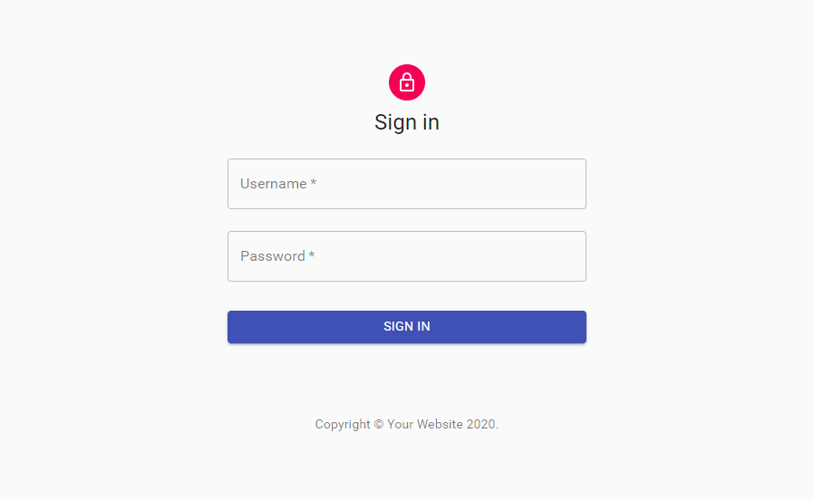
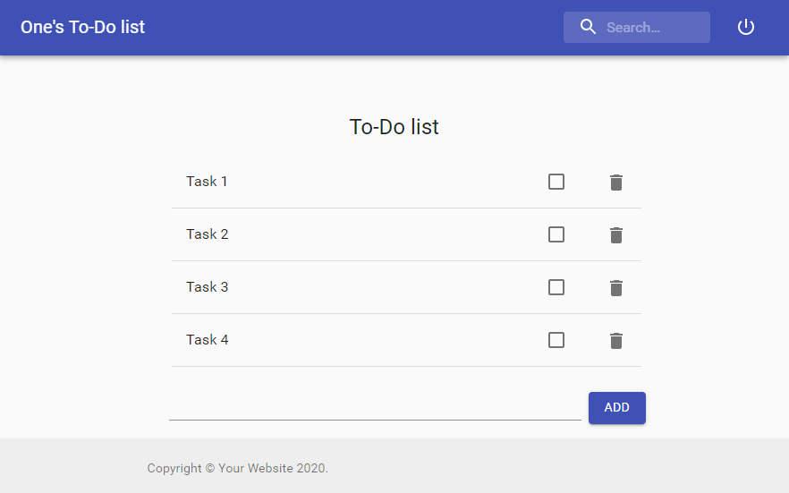

# Django-React Boilerplate Template
This is a boilerplate/template project that can be used to build any websites (portfolio, e-commerce etc.) with Django backend and React frontend. It follows the Hybrid Model, which means it can be deployed as a single unit into the same server. It is set up to use session-based authentication and includes an example of how to use them. It also provides safety from CSRF attacks. This template does not require you to spin up different servers for backend and frontend. The Django server itself acts as a container to run the React application.

## Installation
Run following commands where you want to create the project
```cmd
django-admin.py startproject --template=https://github.com/Parijat29/django-react-boilerplate/archive/master.zip <project_name>
cd <project_name>
pip install requirements.txt
cd frontend
npm install
```

## Build/Run
This repo has been configured with Dev/Prod parity in mind. Use the following commands to build/run the project in appropriate mode

### Development mode
Run following commands at the root of the project directory
```cmd
cd frontend
npm run build
cd ..
SET DJANGO_ENV=development
python manage.py makemigrations
python manage.py migrate
python manage.py createsuperuser
python manage.py runserver
cd frontend
npm start
```

### Production mode
Run following commands at the root of the project directory
```cmd
cd frontend
npm run build
cd ..
SET DJANGO_ENV=production
python manage.py collectstatic
python manage.py makemigrations
python manage.py migrate
python manage.py createsuperuser
waitress-serve backend.wsgi:application
```

## Dependencies
### Python
* Django==2.2.10
* requests==2.22.0
* whitenoise==4.1.4
* djangorestframework==3.11.0
* waitress==1.4.3
* django-cors-headers==3.0.2 (Only used in Development/DEBUG mode)

### React
* fetch==^1.1.0
* react-router-dom==^5.1.2
* @material-ui/core==^4.9.9
* @material-ui/icons==^4.9.1
    

## What is Hybrid Model?
Usually for Single Page Application (SPA)s, the straight forward approach is to serve the frontend and backend in different servers and communicate via REST APIs between the two servers. While this approach might make sense for big teams and enterprise level applications, for small teams or projects it might become an extra overhead to manage and deploy two different applications in two different server instances.  
The **“Hybrid Application”** model is usually implemented by building the frontend, injecting it into the backend’s build process, and deploying the result as a single unit. 
This template project follows the above logic to give you a boilerplate so that you can start coding your application right away without worrying about the complicated setup.  

### Any Additional Benifits? ([^ref1])
* Good SEO.
* The application can be treated as single unit
* Good for trying out Modern JavaScript frameworks on existing Django projects 

### How does the Authetication work?
Since both the forntend and backend is served by same server, all the API calls will be of **same-origin**. This simplifies the authentication process. This boilerplate utilizes Django's built-in **Session-Based** authentication. Django has a very powerful middleware that helps against **CSRF** attacks. This boilerplate/template project utilizes the same middleware. Different permission based access control can also be used as per Django's core features.

### Why is django-cors-headers dependecy needed?
**django-cors-headers** is used only in development or DEBUG mode. This project's **settings.py** is preconfigured to conditionally add it **django-cors-headers** and its related parameters only if the application is running in DEBUG mode.

### Are there any examples?
The boilerplate project already consists of an example To-Do application. This example project showcases most of the important aspects. The example project uses [@material-ui](https://material-ui.com/) to bootstrap the UI. Please feel free to remove the dependencies if they are not required.

### High-level Architecture


## How it looks?

|  | 
|:--:| 
| *Sign-in page* |

|  | 
|:--:| 
| *Main page* |

## License
This project is licensed under the MIT License - see the [LICENSE](LICENSE) file for details

## Acknowledgments
This boilerplate template is inspired by the article [Making React and Django play well together - the “hybrid app” model](https://medium.com/fractal-ideas/making-react-and-django-play-well-together-the-hybrid-app-model-215991793cf6) by [Aymeric Augustin](https://myks.org/en/)

[^ref1]: https://medium.com/fractal-ideas/making-react-and-django-play-well-together-the-hybrid-app-model-215991793cf6
